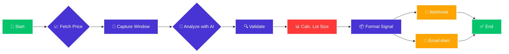

# Visual AI Trading Assistant for MetaTrader 5

[](https://www.python.org/downloads/)
[](https://opensource.org/licenses/MIT)

A sophisticated trading assistant that automates market analysis by combining real-time **MetaTrader 5 API data** with **Google Gemini's visual intelligence**. The system captures trading chart windows, analyzes them for patterns, and generates structured trade signals complete with **automatic lot size calculation** based on your predefined risk management rules.

This tool acts as a powerful decision-support system, designed to feed its analysis into an Expert Advisor (EA) or a separate execution script via webhooks.

## ✨ Core Features

  - **Hybrid Analysis Engine**: Fuses visual chart analysis from any application with live, accurate price data fetched directly from the Meta-Trader 5 Terminal API.
  - **AI-Powered Decision Making**: Leverages Google Gemini 1.5 Flash to interpret complex chart patterns, indicators, and price action, outputting structured JSON trade signals.
  - **Advanced Risk Management**: Automatically calculates the optimal trade volume (lot size) based on account balance, risk percentage, and stop-loss distance to ensure disciplined trading.
  - **Multi-Asset Support**: Pre-configured with correct contract sizes for various assets, including Gold (`XAUUSD`), Silver (`XAGUSD`), and major Forex pairs. Easily extendable for stocks and indices.
  - **Robust Notifications**: Delivers instant email alerts for both successful analyses and critical errors (e.g., API failures, MT5 connection issues), ensuring you're always informed.
  - **Webhook Integration**: Seamlessly pushes generated trade signals to external systems, such as a trading EA, a Telegram bot, or a database, for execution or logging.
  - **Data Integrity & Fallbacks**: Includes validation logic to handle potentially incomplete AI responses and ensures critical data points like `entry_price` are always present.

## ⚙️ System Workflow

The script follows a logical, multi-step process for each run:



## 📁 Project Structure

```
.
├── capture_task.py      # The main automation script
├── prompt.txt           # Customizable prompt for the Gemini AI model
├── run_agent.bat        # Simple Windows batch file to run the script
├── requirements.txt     # List of required Python packages
├── .env.example         # Template for environment variables
└── .env                 # Your local configuration (create from .env.example)
```

## 🛠️ Setup and Installation

### Prerequisites

  - Python 3.8+
  - MetaTrader 5 Desktop Terminal installed and running
  - A Google Gemini API Key
  - An MT5 trading account (Demo or Live)

### Step 1: Download and Setup

Extract the project files to:
```bash
C:\Users\User\Downloads\1073
```

Navigate to the project directory:
```bash
cd C:\Users\User\Downloads\1073
```

### Step 2: Install Dependencies

```bash
pip install -r requirements.txt
```

### Step 3: Environment Configuration

Create environment file from template:

```bash
copy .env.example .env
```

Then edit the `.env` file with your settings:

```env
    # --- API & Window Settings (Required) ---
    GEMINI_API_KEY="your_gemini_api_key_here"
    TARGET_WINDOW_TITLE="MetaTrader 5"

    # --- Trading & Risk Management (Required) ---
    TRADE_SYMBOL="XAUUSD"
    ACCOUNT_BALANCE="10000.0"
    RISK_PERCENTAGE="1.5" # Risk 1.5% of account balance per trade

    # --- Notifications (Optional) ---
    WEBHOOK_URL="https://your-webhook-url.com/endpoint"
    EMAIL_HOST="smtp.gmail.com"
    EMAIL_PORT="587"
    EMAIL_SENDER="your-email@gmail.com"
    EMAIL_PASSWORD="your-app-password" # Use an App Password for Gmail
    EMAIL_RECIPIENT="recipient-email@example.com"
```
 
### Step 4: Configure MetaTrader 5

1.  Open your MT5 Terminal.
2.  Go to `Tools -> Options -> Expert Advisors`.
3.  Check the following boxes:
      - `✅ Allow automated trading`
      - `✅ Allow DLL imports`
4.  Ensure the symbol specified in `TRADE_SYMBOL` is visible in your "Market Watch" panel.

## 🚀 How to Use

### Manual Execution

Run the script directly from your terminal for immediate analysis.

```bash
cd C:\Users\User\Downloads\1073
python capture_task.py
```

### Scheduled Automation (Windows Task Scheduler)

Automate the analysis to run on a schedule (e.g., every hour, or at market open).

1.  **Open Task Scheduler**: Press `Win + R`, type `taskschd.msc`, and press Enter.
2.  **Create Task**: In the "Actions" pane, click "Create Basic Task...".
3.  **Name**: Give it a descriptive name like `MT5 AI Trading Analysis`.
4.  **Trigger**: Choose your desired schedule (e.g., "Daily"). Set the start time and recurrence.
5.  **Action**: Select "Start a program".
      - **Program/script**: `C:\Users\User\Downloads\1073\run_agent.bat`
      - **Start in (optional)**: `cd C:\Users\User\Downloads\1073`
6.  **Finish**: Review and click "Finish".
7.  **Advanced Settings**:
      - Right-click the task and select "Properties".
      - Under the "General" tab, select `Run whether user is logged on or not`.
      - Under the "Conditions" tab, uncheck `Start the task only if the computer is on AC power` if you are using a laptop.

## 🧮 Lot Size Calculation Explained

The script's core risk management feature prevents catastrophic losses by calculating the appropriate trade volume. The detailed calculation is logged for full transparency.

**Formula**:
`Lot Size = (Account Balance * (Risk Percentage / 100)) / ((|Entry Price - Stop Loss|) * Contract Size)`

**Example Log Output**:

```
[2025-09-12 22:59:10] 📊 LOT SIZE CALCULATION:
  Symbol: XAUUSD
  Account Balance: $10,000.00
  Risk Percentage: 1.5%
  Max Risk Amount: $150.00
  Entry Price: 2350.5
  Stop Loss: 2345.0
  Price Difference: 5.5
  Contract Size: 100
  Risk per Lot: $550.00
  Raw Calculation: 0.2727
  Final Lot Size: 0.27
  Actual Risk: $148.50 (✅ SAFE)
  Risk Safety Margin: $1.50
```

## 📊 Output JSON Format

The final output is a clean JSON object, ready for consumption by another application.

**Market Order Example:**

```json
{
    "symbol": "XAUUSD",
    "action": "BUY",
    "entry_price": 2350.50,
    "stop_loss": 2345.00,
    "take_profit": 2365.00,
    "volume": 0.27,
    "confidence": 85,
    "reasoning": "Strong bullish momentum confirmed on the 1H chart after breaking key resistance."
}
```

**Pending Order Example:**

```json
{
    "symbol": "EURUSD",
    "action": "SELL_LIMIT",
    "entry_price": 1.07500,
    "stop_loss": 1.07800,
    "take_profit": 1.07000,
    "volume": 0.50,
    "price": 1.07500,
    "confidence": 90,
    "reasoning": "Anticipating a rejection from a major daily supply zone."
}
```

## 🐛 Troubleshooting

| Issue                               | Solution                                                                                                                                              |
| ----------------------------------- | ----------------------------------------------------------------------------------------------------------------------------------------------------- |
| **MT5 Connection Failed** | 1. Ensure MT5 is running and you are logged in. \<br\> 2. Verify `Allow automated trading` is enabled in MT5 options.                                      |
| **Window Not Found** | 1. Check that `TARGET_WINDOW_TITLE` in your `.env` file exactly matches a part of the visible window's title. \<br\> 2. Ensure the window is not minimized. |
| **Gemini API Errors** | 1. Double-check your `GEMINI_API_KEY`. \<br\> 2. Ensure you have a stable internet connection. \<br\> 3. Check your Google AI Platform billing/quota status. |
| **Email Alert Failed** | 1. For Gmail, ensure you are using a 16-digit **App Password**, not your regular account password. \<br\> 2. Verify `EMAIL_HOST` and `EMAIL_PORT` are correct.  |
| **`ModuleNotFoundError`** | Run `pip install -r requirements.txt` again to ensure all dependencies are installed correctly.                                                       |

## ⚠️ Important Disclaimer

**This is not a fully automated trading robot. It is a decision-support tool that generates trade signals.** You are responsible for how these signals are interpreted and executed.

  - **High Risk Warning**: Trading financial markets involves a high level of risk and may not be suitable for all investors. You could sustain a loss of some or all of your initial investment.
  - **Demo First**: Always test this script extensively on a **demo account** before considering its use with real funds.
  - **No Guarantees**: The AI's analysis is based on patterns and probabilities, not certainties. Past performance is not indicative of future results.
  - **Market Volatility**: Extreme market conditions, such as news events or gaps, can lead to losses exceeding your defined stop-loss.
  - **You Are Responsible**: The user of this script assumes full responsibility for any and all trading decisions and outcomes. Never risk more than you are willing to lose.
