# MetaTrader 5 Visual Trading Automation

A powerful Python-based trading automation system that combines visual screen analysis with MetaTrader 5 API integration. The system captures trading charts, analyzes them using Google's Gemini AI, and executes trades automatically with intelligent lot size calculation based on risk management.

## 🏗️ System Architecture

```mermaid
graph TD
    %% Input Sources
    H[🌐 Streamlit UI] --> A
    I[⚙️ Batch Script] --> A
    
    %% Main Processing Flow
    A[📸 Screen Capture] --> B[🖼️ Image Processing]
    B --> C[🤖 Gemini AI Analysis]
    
    %% Data Sources
    D[💰 MT5 Price Feed] --> E[⚡ Decision Engine]
    C --> E
    
    %% Risk Management
    E --> J[📊 Lot Size Calculator]
    J --> F[📈 Trade Execution]
    
    %% Execution & Output
    F --> G[📡 Webhook Notification]
    
    %% Styling
    classDef inputClass fill:#ff6b6b,stroke:#fff,stroke-width:2px,color:#fff
    classDef processClass fill:#4834d4,stroke:#fff,stroke-width:2px,color:#fff
    classDef aiClass fill:#00d2d3,stroke:#fff,stroke-width:2px,color:#fff
    classDef dataClass fill:#ff9ff3,stroke:#fff,stroke-width:2px,color:#fff
    classDef executeClass fill:#05c46b,stroke:#fff,stroke-width:2px,color:#fff
    classDef outputClass fill:#ffa502,stroke:#fff,stroke-width:2px,color:#fff
    classDef interfaceClass fill:#3742fa,stroke:#fff,stroke-width:2px,color:#fff
    classDef riskClass fill:#ff3838,stroke:#fff,stroke-width:2px,color:#fff
    
    class H,I interfaceClass
    class A inputClass
    class B processClass
    class C aiClass
    class D dataClass
    class J riskClass
    class E,F executeClass
    class G outputClass
```



## 🚀 Features

- **Visual Chart Analysis**: Captures specific trading windows and analyzes them with AI
- **MetaTrader 5 Integration**: Direct API connection for real-time price data and trade execution
- **AI-Powered Decisions**: Uses Google Gemini 1.5 Flash for intelligent trade analysis
- **Smart Risk Management**: Automatic lot size calculation based on account balance and risk percentage
- **Multi-Symbol Support**: Supports Gold, Silver, Forex pairs with proper contract size handling
- **Webhook Support**: Sends trading signals to external systems
- **Interactive Web Interface**: Streamlit-based GUI for manual testing and configuration
- **Automated Execution**: Batch file for scheduled or automated runs

## 📁 Project Structure

```
├── capture_task.py      # Main automation script (MT5 + AI analysis + Lot Calculator)
├── app.py              # Streamlit web interface
├── prompt.txt          # AI analysis prompt template
├── run_agent.bat       # Windows batch file for automation
├── requirements.txt    # Python dependencies
├── .env.example        # Environment configuration template
├── .env               # Environment configuration (create from .env.example)
└── README.md          # This file
```

## 🛠️ Installation

### Prerequisites

| Component | Requirement |
|-----------|-------------|
| Python | 3.8+ ([Download](https://www.python.org/downloads/)) |
| MetaTrader 5 | Installed and configured ([Download](https://www.metatrader5.com/en/download)) |
| Google Gemini | API key required ([Get API Key](https://makersuite.google.com/app/apikey)) |
| Operating System | Windows 10+ (recommended for window capture) |
| Broker Account | MT5 demo/live account with trading symbols |
| Internet | Stable connection for API calls and data feed |

### Step 1: Download and Setup

Extract the project files to:
```bash
C:\Users\User\Downloads\1073
```

Navigate to the project directory:
```bash
cd C:\Users\User\Downloads\1073
```

### Step 2: Install Dependencies

```bash
pip install -r requirements.txt
```

### Step 3: Environment Configuration

Create environment file from template:

```bash
copy .env.example .env
```

Then edit the `.env` file with your settings:

```env
# Your Google Gemini API Key (Required)
GEMINI_API_KEY=your_gemini_api_key_here

# Target window title to capture (Required)
TARGET_WINDOW_TITLE=MetaTrader 5

# Webhook URL to send results to (Optional)
WEBHOOK_URL=https://your-webhook-url.com/endpoint

# --- Custom Trade Settings --- (Required)
TRADE_SYMBOL=XAUUSD

# Lot Size Calculation Settings (Required)
ACCOUNT_BALANCE=10000.00
RISK_PERCENTAGE=2.0
```

### Step 4: MetaTrader 5 Setup

1. **Install MT5**: Download and install MetaTrader 5
2. **Login**: Connect to your broker account
3. **Enable API**: In MT5, go to `Tools > Options > Expert Advisors` and enable:
   - ✅ Allow automated trading
   - ✅ Allow DLL imports
   - ✅ Allow imports of external experts
4. **Add Symbol**: Ensure your trading symbol is visible in Market Watch

## 🎮 Usage

### Method 1: Manual Execution

Run the main automation script:

```bash
cd C:\Users\User\Downloads\1073
python capture_task.py
```

Or use the Windows batch file:
```bash
cd C:\Users\User\Downloads\1073
run_agent.bat
```

### Method 2: Interactive Web Interface

Launch the Streamlit interface:

```bash
cd C:\Users\User\Downloads\1073
streamlit run app.py
```

Then:
1. Enter your Gemini API key in the sidebar
2. Select the MetaTrader 5 window from the dropdown
3. Type `/capture` in the chat to analyze the current chart

### Method 3: Automated Scheduling

Set up daily automated execution using Windows Task Scheduler.

#### Windows Task Scheduler

**Step 1: Open Task Scheduler**
- Press `Windows + R`, type `taskschd.msc`, press Enter
- Or search "Task Scheduler" in Start menu

**Step 2: Create Basic Task**
1. Click "Create Basic Task..." in the right panel
2. **Name**: `MT5 Trading Bot`
3. **Description**: `Daily automated trading analysis with risk management`
4. Click "Next"

**Step 3: Set Trigger**
1. Select "Daily"
2. Set your preferred time (e.g., 9:00 AM for market open)
3. **Recur every**: 1 days
4. Click "Next"

**Step 4: Set Action**
1. Select "Start a program"
2. **Program/script**: `C:\Users\User\Downloads\1073\run_agent.bat`
3. **Start in**: `C:\Users\User\Downloads\1073`
4. Click "Next" then "Finish"

**Step 5: Advanced Settings (Recommended)**
- Right-click your task → "Properties"
- **Security options**: ✅ "Run whether user is logged on or not"
- **Settings**: ✅ "Run task as soon as possible after a scheduled start is missed"
- **Conditions**: Uncheck "Start the task only if the computer is on AC power"

#### Multiple Daily Runs

For multiple analyses per day, create separate tasks for each time slot:
- Task 1: 9:00 AM (Market Open)
- Task 2: 12:00 PM (Midday)
- Task 3: 4:00 PM (Market Close)

#### Enhanced Logging for Scheduled Tasks

Create `run_agent_scheduled.bat` in `C:\Users\User\Downloads\1073\`:
```batch
@echo off
cd /d C:\Users\User\Downloads\1073

if not exist "logs" mkdir logs

echo [%date% %time%] Starting scheduled trading task... >> logs\schedule.log
python capture_task.py >> logs\output.log 2>> logs\errors.log
echo [%date% %time%] Task completed. >> logs\schedule.log
```

## 🔧 Configuration Options

### Environment Variables

| Variable | Description | Required | Example |
|----------|-------------|----------|---------|
| `GEMINI_API_KEY` | Google Gemini API key for AI analysis | ✅ Yes | `AIzaSyC...` |
| `TARGET_WINDOW_TITLE` | Partial window title to capture | ✅ Yes | `MetaTrader 5` |
| `TRADE_SYMBOL` | Trading symbol | ✅ Yes | `XAUUSD` |
| `ACCOUNT_BALANCE` | Account balance for lot calculation | ✅ Yes | `10000.00` |
| `RISK_PERCENTAGE` | Risk percentage per trade | ✅ Yes | `2.0` |
| `WEBHOOK_URL` | URL to send trade signals | ❌ Optional | `https://...` |

### Supported Trading Symbols

The system supports various symbols with proper contract size handling:

| Symbol | Description | Contract Size | Risk Unit |
|--------|-------------|---------------|-----------|
| `XAUUSD` | Gold | 100 oz | Per ounce |
| `XAGUSD` | Silver | 5,000 oz | Per ounce |
| `EURUSD` | Euro/Dollar | 100,000 | Per pip |
| `GBPUSD` | Pound/Dollar | 100,000 | Per pip |
| `USDJPY` | Dollar/Yen | 100,000 | Per pip |
| `AUDUSD` | Aussie/Dollar | 100,000 | Per pip |
| `USDCAD` | Dollar/Canadian | 100,000 | Per pip |
| `USDCHF` | Dollar/Franc | 100,000 | Per pip |
| `NZDUSD` | Kiwi/Dollar | 100,000 | Per pip |

### Risk Management System

The system automatically calculates lot sizes based on:

1. **Account Balance**: Your total account equity
2. **Risk Percentage**: Maximum percentage to risk per trade (recommended: 1-3%)
3. **Stop Loss Distance**: Distance between entry and stop loss
4. **Symbol Contract Size**: Proper contract specifications

**Example Calculation**:
```
Account Balance: $10,000
Risk Percentage: 2%
Risk Amount: $200
Entry Price: $2,665.50 (XAUUSD)
Stop Loss: $2,650.50
Price Difference: $15.00
Contract Size: 100 oz
Risk per Lot: $15.00 × 100 = $1,500
Calculated Lot Size: $200 ÷ $1,500 = 0.13 lots
```

### Prompt Template

The system uses `prompt.txt` file for AI analysis instructions. The current prompt focuses on:
- Multi-timeframe analysis (1h, 30m, 1m)
- Price action patterns
- Support and resistance levels
- Risk management with stop loss and take profit

## 📊 Output Format

The system outputs trading decisions in JSON format with calculated lot sizes:

### Market Orders (BUY/SELL)
```json
{
    "symbol": "XAUUSD",
    "action": "BUY",
    "volume": 0.13,
    "stop_loss": 2650.50,
    "take_profit": 2680.00
}
```

### Pending Orders (LIMIT/STOP)
```json
{
    "symbol": "XAUUSD",
    "action": "SELL_LIMIT",
    "price": 2670.00,
    "volume": 0.13,
    "stop_loss": 2675.00,
    "take_profit": 2655.00
}
```

## 🧮 Lot Size Calculation Details

The system provides detailed logging of lot size calculations:

```
[2025-01-15 10:30:21] 📊 LOT SIZE CALCULATION:
  Symbol: XAUUSD
  Account Balance: $10,000.00
  Risk Percentage: 2%
  Max Risk Amount: $200.00
  Entry Price: 2665.5
  Stop Loss: 2650.5
  Price Difference: 15.0
  Contract Size: 100
  Risk per Lot: $1500.00
  Raw Calculation: 0.1333
  Final Lot Size: 0.13
  Actual Risk: $195.00 (✅ SAFE)
  Risk Safety Margin: $5.00
```

## 🐛 Troubleshooting

### Common Issues

**MetaTrader 5 Connection Failed**
- Ensure MT5 is running and logged in
- Check that automated trading is enabled
- Verify your symbol is in Market Watch

**Screen Capture Returns Black Image**
- Disable hardware acceleration in your browser/MT5
- Run the script as administrator
- Check if window is minimized or behind other windows

**Gemini API Errors**
- Verify your API key is correct
- Check your API quota and billing
- Ensure stable internet connection

**Window Not Found**
- Update `TARGET_WINDOW_TITLE` to match your MT5 window title
- Use the Streamlit interface to see available windows
- Try partial window titles (e.g., "MetaTrader" instead of full title)

**Lot Size Calculation Issues**
- Ensure `ACCOUNT_BALANCE` and `RISK_PERCENTAGE` are set correctly
- Check that the symbol is supported (add custom symbols to `SYMBOL_CONTRACT_SIZES`)
- Verify stop loss is different from entry price

**Module Not Found Error**
```bash
cd C:\Users\User\Downloads\1073
pip install -r requirements.txt
```

### Debug Mode

Enable detailed logging by running:

```bash
cd C:\Users\User\Downloads\1073
python -c "import logging; logging.basicConfig(level=logging.DEBUG)" && python capture_task.py
```

## ⚠️ Risk Disclaimer

**IMPORTANT**: This is an automated trading system that can place real trades with real money.

- Always test on a demo account first
- The lot size calculator is designed to limit risk, but market gaps can exceed stop losses
- Use appropriate position sizing (recommended: 1-3% risk per trade)
- Monitor the system regularly
- Understand that AI predictions are not guaranteed
- Past performance does not indicate future results
- Use proper risk management at all times
- Never risk more than you can afford to lose

## 🔒 Security

- Store API keys in `.env` file (never commit to version control)
- Use webhook authentication if sending signals externally
- Regularly rotate API keys
- Monitor trading activity for unusual behavior
- Keep account balance information secure

## 📝 Logging

The system provides detailed console logging including risk management:

```
[2025-01-15 10:30:15] 🚀 Starting Visual Automation Trading Task (MT5 API Mode)
[2025-01-15 10:30:15] 📊 TRADING CONFIGURATION:
  Symbol: XAUUSD
  Account Balance: $10,000.00
  Risk Percentage: 2%
  Risk Amount: $200.00
[2025-01-15 10:30:16] 📈 Connecting to MetaTrader 5 terminal...
[2025-01-15 10:30:17] ✅ Price from MT5 for XAUUSD: $2665.43000
[2025-01-15 10:30:18] Window 'MetaTrader 5' captured successfully!
[2025-01-15 10:30:20] ✅ Analysis successful!
[2025-01-15 10:30:21] 📊 LOT SIZE CALCULATION: [detailed calculation]
[2025-01-15 10:30:21] ✅ Task Completed Successfully!
```

## 📞 Support

For issues and questions:
- Check the troubleshooting section above
- Review MetaTrader 5 API documentation
- Consult Google Gemini API documentation
- Verify risk management settings are appropriate for your account

---

**Version**: 2.0 - Now with intelligent lot size calculation and enhanced risk management
