# Visual AI Trading Assistant for MetaTrader 5

[](https://www.python.org/downloads/)
[](https://opensource.org/licenses/MIT)

A sophisticated trading assistant that automates market analysis by combining real-time **MetaTrader 5 API data** with **Google Gemini's visual intelligence**. The system captures trading chart windows, analyzes them for patterns, and generates structured trade signals complete with **automatic lot size calculation** based on your predefined risk management rules.

This tool acts as a powerful decision-support system, designed to feed its analysis into an Expert Advisor (EA) or a separate execution script via webhooks.

## ✨ Core Features

  - **Hybrid Analysis Engine**: Fuses visual chart analysis from any application with live, accurate price data fetched directly from the Meta-Trader 5 Terminal API.
  - **AI-Powered Decision Making**: Leverages Google Gemini 1.5 Flash to interpret complex chart patterns, indicators, and price action, outputting structured JSON trade signals.
  - **Advanced Risk Management**: Automatically calculates the optimal trade volume (lot size) based on account balance, risk percentage, and stop-loss distance to ensure disciplined trading.
  - **Multi-Asset Support**: Pre-configured with correct contract sizes for various assets, including Gold (`XAUUSD`), Silver (`XAGUSD`), and major Forex pairs. Easily extendable for stocks and indices.
  - **Robust Notifications**: Delivers instant email alerts for both successful analyses and critical errors (e.g., API failures, MT5 connection issues), ensuring you're always informed.
  - **Webhook Integration**: Seamlessly pushes generated trade signals to external systems, such as a trading EA, a Telegram bot, or a database, for execution or logging.
  - **Data Integrity & Fallbacks**: Includes validation logic to handle potentially incomplete AI responses and ensures critical data points like `entry_price` are always present.

## ⚙️ System Workflow

The script follows a logical, multi-step process for each run:

```mermaid
graph LR
    A[🚀 Start] --> B{📈 Fetch Price};
    B --> C[📸 Capture Window];
    C --> D{🧠 Analyze with AI};
    D --> E[🔍 Validate];
    E --> F[📊 Calc. Lot Size];
    F --> G[📦 Format Signal];
    G --> H[📧 Email Alert];
    G --> I[📡 Webhook];
    I --> J[✅ End];
    H --> J;

    %% Node Styling
    classDef start_end fill:#05c46b,stroke:#fff,stroke-width:2px,color:#fff;
    classDef process fill:#4834d4,stroke:#fff,stroke-width:2px,color:#fff;
    classDef critical_process fill:#ff3838,stroke:#fff,stroke-width:2px,color:#fff;
    classDef output fill:#ffa502,stroke:#fff,stroke-width:2px,color:#fff;

    class A,J start_end;
    class B,C,D,E,G process;
    class F critical_process;
    class H,I output;
```



## 📁 Project Structure

```
.
├── capture_task.py      # The main automation script
├── prompt.txt           # Customizable prompt for the Gemini AI model
├── run_agent.bat        # Simple Windows batch file to run the script
├── requirements.txt     # List of required Python packages
├── .env.example         # Template for environment variables
└── .env                 # Your local configuration (create from .env.example)
```

## 🛠️ Setup and Installation

### Prerequisites

  - Python 3.8+
  - MetaTrader 5 Desktop Terminal installed and running
  - A Google Gemini API Key
  - An MT5 trading account (Demo or Live)

### Step 1: Download and Setup

Extract the project files to:
```bash
C:\Users\User\Downloads\1073
```

Navigate to the project directory:
```bash
cd C:\Users\User\Downloads\1073
```

### Step 2: Install Dependencies

```bash
pip install -r requirements.txt
```

### Step 3: Environment Configuration

Create environment file from template:

```bash
copy .env.example .env
```

Then edit the `.env` file with your settings:

```env
    # --- API & Window Settings (Required) ---
    GEMINI_API_KEY="your_gemini_api_key_here"
    TARGET_WINDOW_TITLE="MetaTrader 5"

    # --- Trading & Risk Management (Required) ---
    TRADE_SYMBOL="XAUUSD"
    ACCOUNT_BALANCE="10000.0"
    RISK_PERCENTAGE="1.5" # Risk 1.5% of account balance per trade

    # --- Notifications (Optional) ---
    WEBHOOK_URL="https://your-webhook-url.com/endpoint"
    EMAIL_HOST="smtp.gmail.com"
    EMAIL_PORT="587"
    EMAIL_SENDER="your-email@gmail.com"
    EMAIL_PASSWORD="your-app-password" # Use an App Password for Gmail
    EMAIL_RECIPIENT="recipient-email@example.com"
```
 
### Step 4: Configure MetaTrader 5

1.  Open your MT5 Terminal.
2.  Go to `Tools -> Options -> Expert Advisors`.
3.  Check the following boxes:
      - `✅ Allow automated trading`
      - `✅ Allow DLL imports`
4.  Ensure the symbol specified in `TRADE_SYMBOL` is visible in your "Market Watch" panel.

## 🚀 How to Use
### Method 1: Manual Execution

Run the main automation script:

```bash
cd C:\Users\User\Downloads\1073
python capture_task.py
```

Or use the Windows batch file:
```bash
cd C:\Users\User\Downloads\1073
run_agent.bat
```

### Method 2: Interactive Web Interface

Launch the Streamlit interface:

```bash
cd C:\Users\User\Downloads\1073
streamlit run app.py
```

Then:
1. Enter your Gemini API key in the sidebar
2. Select the MetaTrader 5 window from the dropdown
3. Type `/capture` in the chat to analyze the current chart

### Method 3: Automated Scheduling

Set up daily automated execution using Windows Task Scheduler.

#### Windows Task Scheduler

**Step 1: Open Task Scheduler**
- Press `Windows + R`, type `taskschd.msc`, press Enter
- Or search "Task Scheduler" in Start menu

**Step 2: Create Basic Task**
1. Click "Create Basic Task..." in the right panel
2. **Name**: `MT5 Trading Bot`
3. **Description**: `Daily automated trading analysis with risk management`
4. Click "Next"

**Step 3: Set Trigger**
1. Select "Daily"
2. Set your preferred time (e.g., 9:00 AM for market open)
3. **Recur every**: 1 days
4. Click "Next"

**Step 4: Set Action**
1. Select "Start a program"
2. **Program/script**: `C:\Users\User\Downloads\1073\run_agent.bat`
3. **Start in**: `C:\Users\User\Downloads\1073`
4. Click "Next" then "Finish"

**Step 5: Advanced Settings (Recommended)**
- Right-click your task → "Properties"
- **Security options**: ✅ "Run whether user is logged on or not"
- **Settings**: ✅ "Run task as soon as possible after a scheduled start is missed"
- **Conditions**: Uncheck "Start the task only if the computer is on AC power"

#### Multiple Daily Runs

For multiple analyses per day, create separate tasks for each time slot:
- Task 1: 9:00 AM (Market Open)
- Task 2: 12:00 PM (Midday)
- Task 3: 4:00 PM (Market Close)

#### Enhanced Logging for Scheduled Tasks

Create `run_agent_scheduled.bat` in `C:\Users\User\Downloads\1073\`:
```batch
@echo off
cd /d C:\Users\User\Downloads\1073

if not exist "logs" mkdir logs

echo [%date% %time%] Starting scheduled trading task... >> logs\schedule.log
python capture_task.py >> logs\output.log 2>> logs\errors.log
echo [%date% %time%] Task completed. >> logs\schedule.log
```

## 🔧 Configuration Options

### Environment Variables

| Variable | Description | Required | Example |
|----------|-------------|----------|---------|
| `GEMINI_API_KEY` | Google Gemini API key for AI analysis | ✅ Yes | `AIzaSyC...` |
| `TARGET_WINDOW_TITLE` | Partial window title to capture | ✅ Yes | `MetaTrader 5` |
| `TRADE_SYMBOL` | Trading symbol | ✅ Yes | `XAUUSD` |
| `ACCOUNT_BALANCE` | Account balance for lot calculation | ✅ Yes | `10000.00` |
| `RISK_PERCENTAGE` | Risk percentage per trade | ✅ Yes | `2.0` |
| `WEBHOOK_URL` | URL to send trade signals | ❌ Optional | `https://...` |

### Supported Trading Symbols

The system supports various symbols with proper contract size handling:

| Symbol | Description | Contract Size | Risk Unit |
|--------|-------------|---------------|-----------|
| `XAUUSD` | Gold | 100 oz | Per ounce |
| `XAGUSD` | Silver | 5,000 oz | Per ounce |
| `EURUSD` | Euro/Dollar | 100,000 | Per pip |
| `GBPUSD` | Pound/Dollar | 100,000 | Per pip |
| `USDJPY` | Dollar/Yen | 100,000 | Per pip |
| `AUDUSD` | Aussie/Dollar | 100,000 | Per pip |
| `USDCAD` | Dollar/Canadian | 100,000 | Per pip |
| `USDCHF` | Dollar/Franc | 100,000 | Per pip |
| `NZDUSD` | Kiwi/Dollar | 100,000 | Per pip |

### Risk Management System

The system automatically calculates lot sizes based on:

1. **Account Balance**: Your total account equity
2. **Risk Percentage**: Maximum percentage to risk per trade (recommended: 1-3%)
3. **Stop Loss Distance**: Distance between entry and stop loss
4. **Symbol Contract Size**: Proper contract specifications

**Example Calculation**:
```
Account Balance: $10,000
Risk Percentage: 2%
Risk Amount: $200
Entry Price: $2,665.50 (XAUUSD)
Stop Loss: $2,650.50
Price Difference: $15.00
Contract Size: 100 oz
Risk per Lot: $15.00 × 100 = $1,500
Calculated Lot Size: $200 ÷ $1,500 = 0.13 lots
```

### Prompt Template

The system uses `prompt.txt` file for AI analysis instructions. The current prompt focuses on:
- Multi-timeframe analysis (1h, 30m, 1m)
- Price action patterns
- Support and resistance levels
- Risk management with stop loss and take profit

## 📊 Output JSON Format

The final output is a clean JSON object, ready for consumption by another application.

**Market Order Example:**

```json
{
    "symbol": "XAUUSD",
    "action": "BUY",
    "entry_price": 2350.50,
    "stop_loss": 2345.00,
    "take_profit": 2365.00,
    "volume": 0.27,
    "confidence": 85,
    "reasoning": "Strong bullish momentum confirmed on the 1H chart after breaking key resistance."
}
```

**Pending Order Example:**

```json
{
    "symbol": "EURUSD",
    "action": "SELL_LIMIT",
    "entry_price": 1.07500,
    "stop_loss": 1.07800,
    "take_profit": 1.07000,
    "volume": 0.50,
    "price": 1.07500,
    "confidence": 90,
    "reasoning": "Anticipating a rejection from a major daily supply zone."
}
```

## 🐛 Troubleshooting

| Issue                               | Solution                                                                                                                                              |
| ----------------------------------- | ----------------------------------------------------------------------------------------------------------------------------------------------------- |
| **MT5 Connection Failed** | 1. Ensure MT5 is running and you are logged in. \<br\> 2. Verify `Allow automated trading` is enabled in MT5 options.                                      |
| **Window Not Found** | 1. Check that `TARGET_WINDOW_TITLE` in your `.env` file exactly matches a part of the visible window's title. \<br\> 2. Ensure the window is not minimized. |
| **Gemini API Errors** | 1. Double-check your `GEMINI_API_KEY`. \<br\> 2. Ensure you have a stable internet connection. \<br\> 3. Check your Google AI Platform billing/quota status. |
| **Email Alert Failed** | 1. For Gmail, ensure you are using a 16-digit **App Password**, not your regular account password. \<br\> 2. Verify `EMAIL_HOST` and `EMAIL_PORT` are correct.  |
| **`ModuleNotFoundError`** | Run `pip install -r requirements.txt` again to ensure all dependencies are installed correctly.                                                       |

## ⚠️ Important Disclaimer

**This is not a fully automated trading robot. It is a decision-support tool that generates trade signals.** You are responsible for how these signals are interpreted and executed.

  - **High Risk Warning**: Trading financial markets involves a high level of risk and may not be suitable for all investors. You could sustain a loss of some or all of your initial investment.
  - **Demo First**: Always test this script extensively on a **demo account** before considering its use with real funds.
  - **No Guarantees**: The AI's analysis is based on patterns and probabilities, not certainties. Past performance is not indicative of future results.
  - **Market Volatility**: Extreme market conditions, such as news events or gaps, can lead to losses exceeding your defined stop-loss.
  - **You Are Responsible**: The user of this script assumes full responsibility for any and all trading decisions and outcomes. Never risk more than you are willing to lose.
